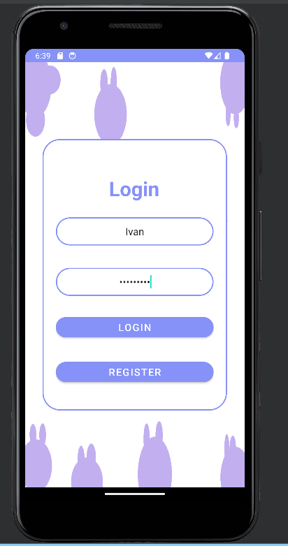
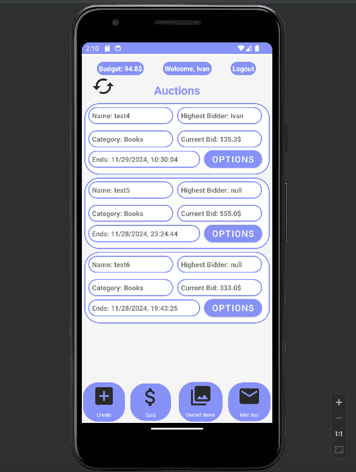
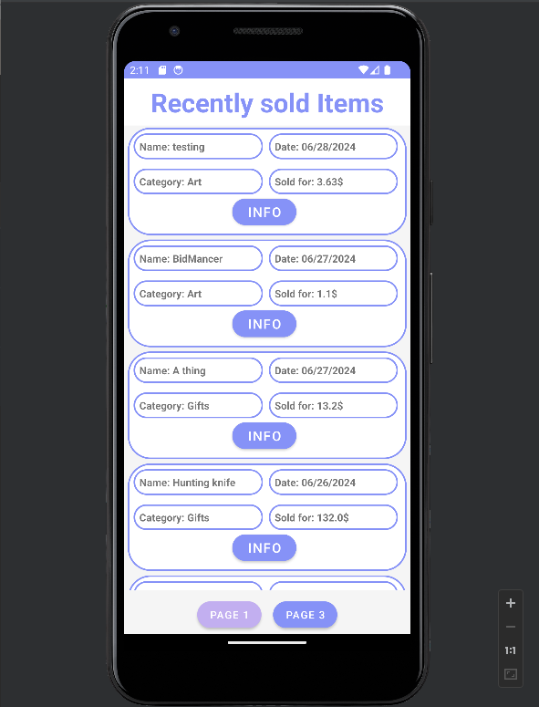
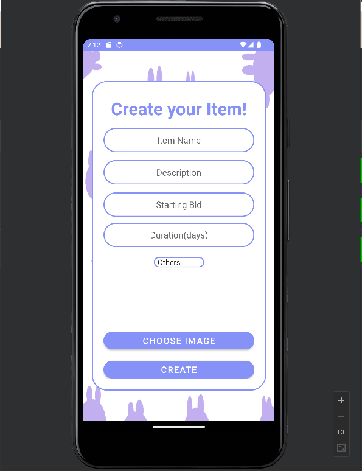
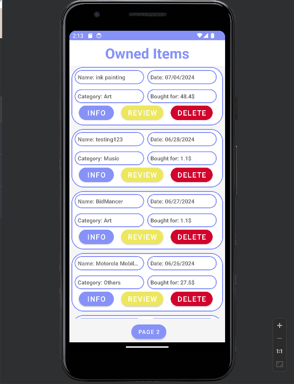
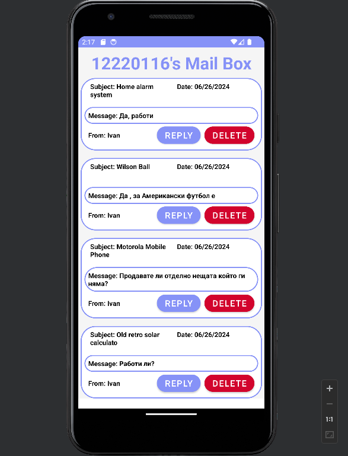
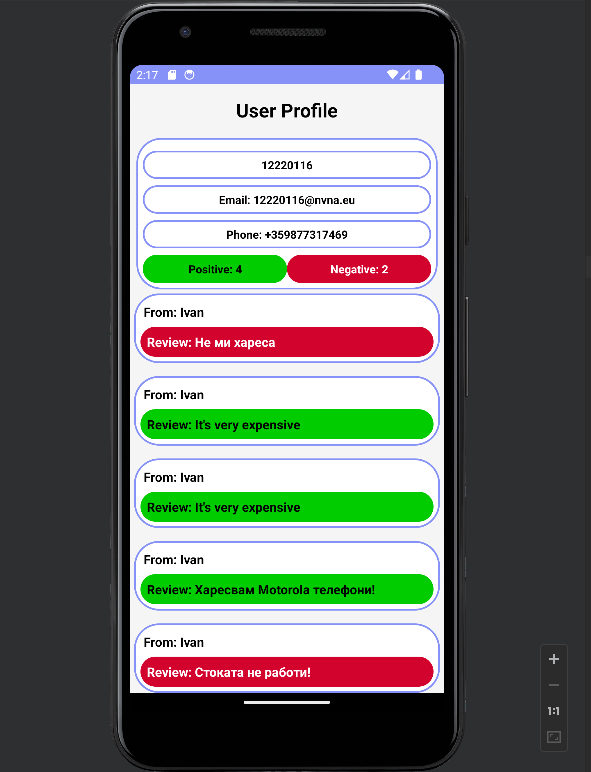

# Adroid app with Kotlin

The second ever android app that I made with kotlin that works as a different client for my Flask auction app (check this : https://github.com/ChunChun20/AuctionAppPart2 ). 
There are some bugs but It did good enough job for the project.

# Login page

Really simple login page.

# Main page

Here users can check the current active auctions. They have the options to place minimal bid, custom bid which has to be higher or equal to the minimal , check the item information (image,description) or check the profile of
the user to listed that item and send a mail with questions.

# Recent sales

Here users can check all of the items that were recently sold. They get information about the price at which the item sold , when it sold , who won it as well as the option to check the item information and even more.

# Create Item

Here users can add their items to the auction after filling the needed information.

# Owned items 

When a user wins auction the information about the item goes to their owned items page. Here they can decide if they want to sell it again , place review on the seller or delete it.

# Mailbox

Here users can check their received mails from other users and they have the option to reply or delete the mails.

# User page

Here the users can see information about their own profile or about the profile of other users such as their email address,phone number,their reviews and they also get the option to send them a mail to their mailbox.

